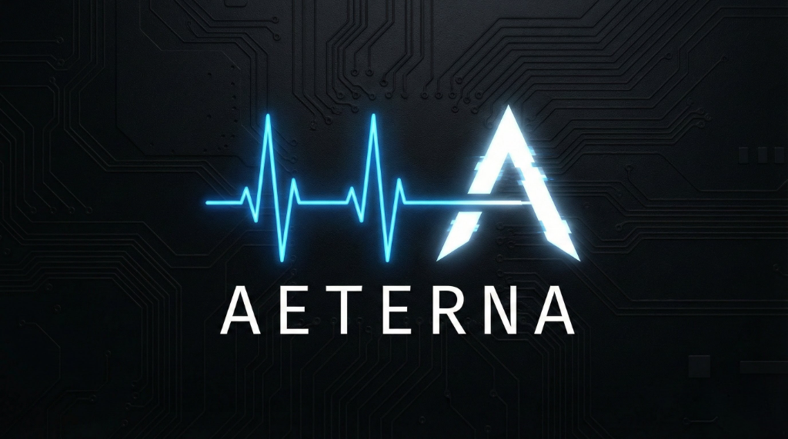

# Aeterna

<p align="center">
  
</p>

<p align="center">
  
  
  
  
  
</p>

*"What words would you leave behind?"*

---

Aeterna is a dead man's switch. You write messages. You check in regularly. If you stop checking in, your messages are delivered.

It's that simple. And that important.

Aeterna holds these words. It watches. It waits. And when the time comes, it delivers.

## Key Features

- **Email Delivery**: Automatic delivery of your messages and files to your loved ones if you fail to check in.
- **Webhook Integration**: Trigger external services (home automation, custom scripts, etc.) when your switch is activated.
- **File Attachments**: Securely attach sensitive documents, photos, or instructions to your switches.
- **Auto-Cleanup**: Attachments are automatically deleted from the server immediately after delivery for maximum privacy.
- **One-Click Install**: Comprehensive installation wizard.
- **Heartbeat System**: Simple check-in mechanism via web UI or a quick-link from your email.
- **Privacy-Focused Architecture**: Messages and attachments are encrypted at rest (AES-256-GCM) on your private server, ensuring they are only decrypted at the moment of delivery.

## Quick Start

```bash
git clone https://github.com/alpyxn/aeterna.git
cd aeterna
./install.sh
```

### Manual Installation (Docker)

If you prefer not to use the installation script, you can install Aeterna manually using Docker Compose:

1. **Clone the repository:**
   ```bash
   git clone https://github.com/alpyxn/aeterna.git
   cd aeterna
   ```

2. **Generate encryption key:**
   ```bash
   mkdir -p secrets
   openssl rand -base64 32 | tr -d '\n' > secrets/encryption_key
   chmod 600 secrets/encryption_key
   ```

3. **Configure environment:**
   Create a `.env` file based on your environment.
   ```bash
   cp .env.production.example .env
   # Edit .env and configure your DOMAIN, etc.
   nano .env
   ```

4. **Start the services:**
   *For production (requires existing Nginx setup or handles its own via `docker-compose.nginx.yml`):*
   ```bash
   docker compose -f docker-compose.nginx.yml up -d
   ```
   *For testing/development (no SSL):*
   ```bash
   docker compose -f docker-compose.simple.yml up -d
   ```

### Installation Modes

During installation, you will be prompted to choose a mode:

1. **Production (Nginx + SSL)** - *Recommended*
   - Automatic HTTPS with Let's Encrypt
   - Nginx reverse proxy
   - Secure headers and configuration

2. **Development (Simple)** - *Not Recommended for Production*
   - Runs directly on port 5000 (IP address only)
   - **No encryption/SSL** - insecure for sensitive data
   - Useful only for local testing or development

## Management

The `install.sh` script includes management commands:

| Command | Description |
|---------|-------------|
| `./install.sh --update` | Update to the latest version |
| `./install.sh --backup` | Create a full backup of data and config |
| `./install.sh --status` | Check service health and status |
| `./install.sh --uninstall` | Remove containers and installation |

## Configuration

The installer guides you through basic configuration:
- **Domain**: Your domain name (required for SSL)
- **Encryption**: Automatically generates a unique AES-256 key

**SMTP Settings** (required for sending emails) are configured post-installation through the application's **Settings** menu. This allows for live testing and easier management.

## Security

Aeterna handles security automatically:
- **Encryption**: Messages and file attachments are encrypted at rest using AES-256-GCM.
- **Key Management**: The encryption key is generated securely and stored in `secrets/encryption_key`. It is **never** exposed in environment variables or configuration files.
- **Data Pruning**: File attachments are permanently deleted from the disk after successful delivery to the recipient.
- **SSL**: Automatic certificate management via Let's Encrypt (in Production mode).

## Architecture

```
backend/     Go API server
frontend/    React application  
```

Both containerized. SQLite for storage (single file database). nginx for reverse proxy and SSL.

## License

GPL-3.0

---

*Named for the Latin word meaning "eternal" — because some messages are meant to outlast us.*
