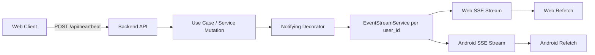
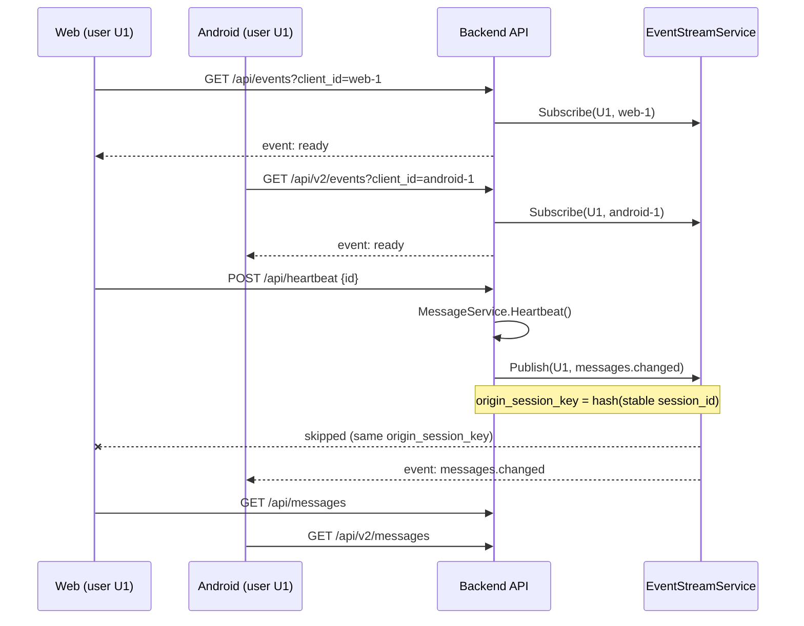

# Realtime Events (SSE)

This document describes the real-time synchronization channel used by Aeterna to keep multiple clients (Web + Android) in sync.

The system uses **SSE (Server-Sent Events)** as a user-scoped refresh-notification channel.

## Goal

When one device changes state (for example heartbeat, message update, attachment change), other devices of the same user receive an event and refresh their data.

Events are **refresh hints**, not source of truth.

To reduce self-notifications, events emitted by an authenticated request are tagged with an internal `origin_session_key` and are not delivered back to SSE connections bound to the same session.

## High-Level Flow



## Transport Choice

- Protocol: SSE (`text/event-stream`)
- Direction: server -> client only
- Reconnect: automatic at browser/client level

SSE is used instead of WebSocket because current need is one-way notifications and lower operational complexity.

## Endpoints

- `GET /api/events`
  - Uses session cookie auth (`/api` protected group).
- `GET /api/v2/events`
  - Uses Bearer auth (`/api/v2` protected group).

Both endpoints are protected and scoped to authenticated `user_id`.

## Authentication and Tenant Scope

1. Middleware authenticates request.
2. Handler resolves `user_id` from `c.Locals("user_id")`.
3. Connection is registered under that user only.
4. Published events are routed only to that user’s active connections.

This guarantees user A never receives user B events.

Current behavior note:
- The client that triggers the mutation is filtered out when the request and SSE stream share the same session identity.
- Origin-session filtering is applied in the current implementation.

## Sequence (Two Devices, Same User)



## Connection Lifecycle

Optional query param:

```http
GET /api/events?client_id=<stable-device-id>
```

`client_id` behavior:

- Recommended per device/app instance.
- If same `user_id + client_id` reconnects, previous stream is stopped.
- Prevents duplicate ghost streams after reconnects.

Server stream headers:

- `Content-Type: text/event-stream`
- `Cache-Control: no-cache`
- `Connection: keep-alive`
- `X-Accel-Buffering: no`

Initial and keepalive events:

- `ready` on successful connection.
- `ping` every ~20 seconds to keep connection alive.

## Event Contract

`ports.RealtimeEvent` payload:

```json
{
  "type": "messages.changed",
  "code": "message.heartbeat",
  "at": "2026-05-17T05:10:00Z",
  "data": {
    "resource": "message",
    "entity_id": "msg-id-123",
    "reason": "heartbeat"
  },
  "resource": "message",
  "entity_id": "msg-id-123",
  "reason": "heartbeat"
}
```

Fields:

- `type` (required): logical event type.
- `code` (recommended): stable machine-readable code for cross-platform notification rules.
- `at` (required): UTC timestamp.
- `data` (recommended): normalized payload envelope (`resource`, `entity_id`, `reason`).
- `resource` (optional): affected resource class.
- `entity_id` (optional): affected entity id when available.
- `reason` (optional): mutation reason label.

Compatibility note:
- `resource`, `entity_id`, and `reason` remain at top-level for backward compatibility.
- New clients should prefer `code` + `data`.
- `origin_session_key` is internal-only and is not serialized in SSE JSON payloads.
- The origin-session key is derived from a stable session identifier, so access-token refresh does not break self-event filtering.

## Event Types

Base stream events:

- `ready`
- `ping`

Domain refresh events:

- `messages.changed`
- `attachments.changed`
- `farewells.changed`
- `settings.changed`
- `webhooks.changed`

## Event Codes

Stream:
- `stream.ready`
- `stream.ping`

Messages:
- `message.created`
- `message.updated`
- `message.deleted`
- `message.heartbeat`
- `message.bulk_heartbeat`
- `message.attachment_uploaded`
- `message.attachment_deleted`
- `message.farewell_created`
- `message.farewell_updated`
- `message.farewell_deleted`

Attachments:
- `attachment.uploaded`
- `attachment.deleted`

Farewells:
- `farewell.created`
- `farewell.updated`
- `farewell.deleted`
- `farewell_attachment.uploaded`
- `farewell_attachment.deleted`

Settings/Webhooks:
- `settings.saved`
- `webhook.created`
- `webhook.updated`
- `webhook.deleted`

## Where Events Are Emitted

Emission is handled in **service decorators** (not HTTP handlers), so transport layer stays thin and business mutations own the side effects:

- `NotifyingMessageService`
- `NotifyingFileService`
- `NotifyingFarewellService`
- `NotifyingSettingsService`
- `NotifyingWebhookStore`

These wrappers publish events after successful mutations.

## Reason Variants Used by Current Mutations

Some event codes are reused with different `reason` values to distinguish operation types:

- `message.farewell_deleted`
  - `farewell_deleted` (direct delete)
  - `farewell_canceled` (single pending cancellation)
  - `farewells_canceled` (bulk pending cancellation)
- `farewell.deleted`
  - `deleted` (direct delete)
  - `canceled` (single pending cancellation)
  - `canceled_all` (bulk pending cancellation)

## Memory and Load Protection

Environment variables:

- `SSE_MAX_CONNECTIONS_GLOBAL` (default `2000`)
- `SSE_MAX_CONNECTIONS_PER_USER` (default `5`)
- `SSE_CLIENT_BUFFER_SIZE` (default `32`)

Protections:

- Global connection cap.
- Per-user connection cap.
- Per-client bounded event buffer.
- Slow consumers are disconnected when buffer is full.
- Stream uses a separate `done` signal to stop clients safely without channel-close send panics.

## Client Behavior (Recommended)

Clients should:

1. Open SSE stream after login.
2. Listen for domain events.
3. Trigger selective refetch per event type.
4. Keep periodic fallback polling (30-60s) for resilience.

### Web (EventSource)

```js
const es = new EventSource("/api/events?client_id=<id>", { withCredentials: true });
es.addEventListener("messages.changed", refreshMessages);
es.addEventListener("attachments.changed", refreshMessages);
es.addEventListener("farewells.changed", refreshMessages);
```

### Android (Bearer on `/api/v2/events`)

Use an SSE-capable HTTP client (for example OkHttp SSE) and send:

```http
Authorization: Bearer <access_token>
```

On `*.changed`, refresh local view/model from API.

## Operational Notes

- Current implementation is in-memory and instance-local.
- In multi-instance deployments, add cross-instance fanout (for example Redis Pub/Sub).
- Do not trust SSE payload as final data; always refetch from authoritative API endpoints.
